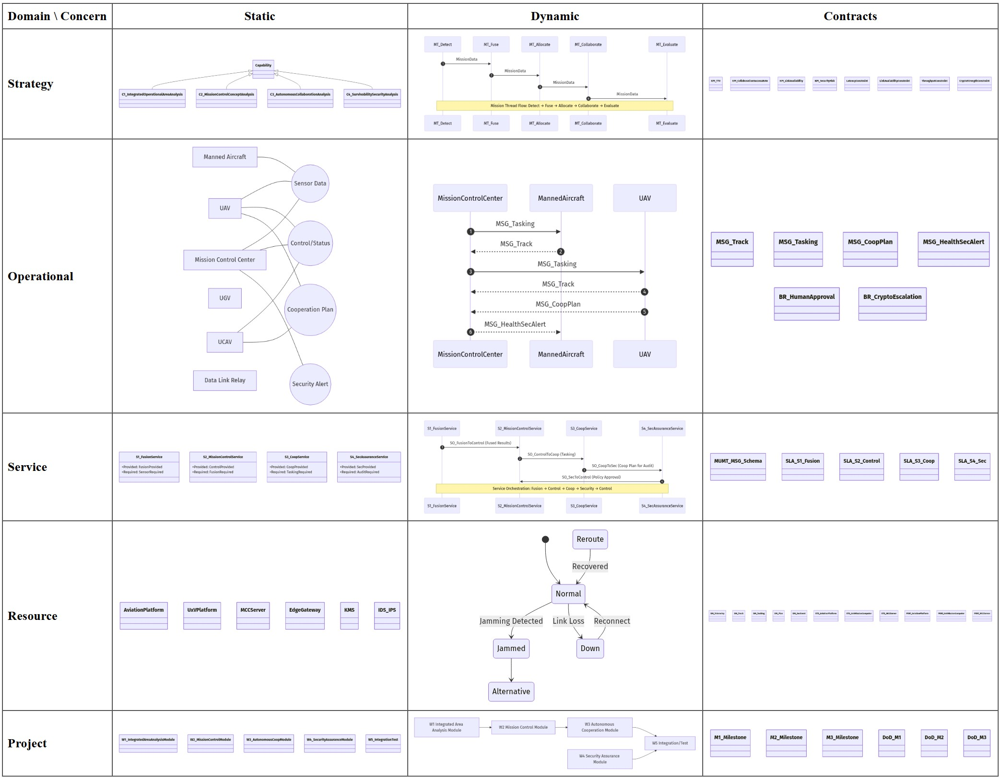
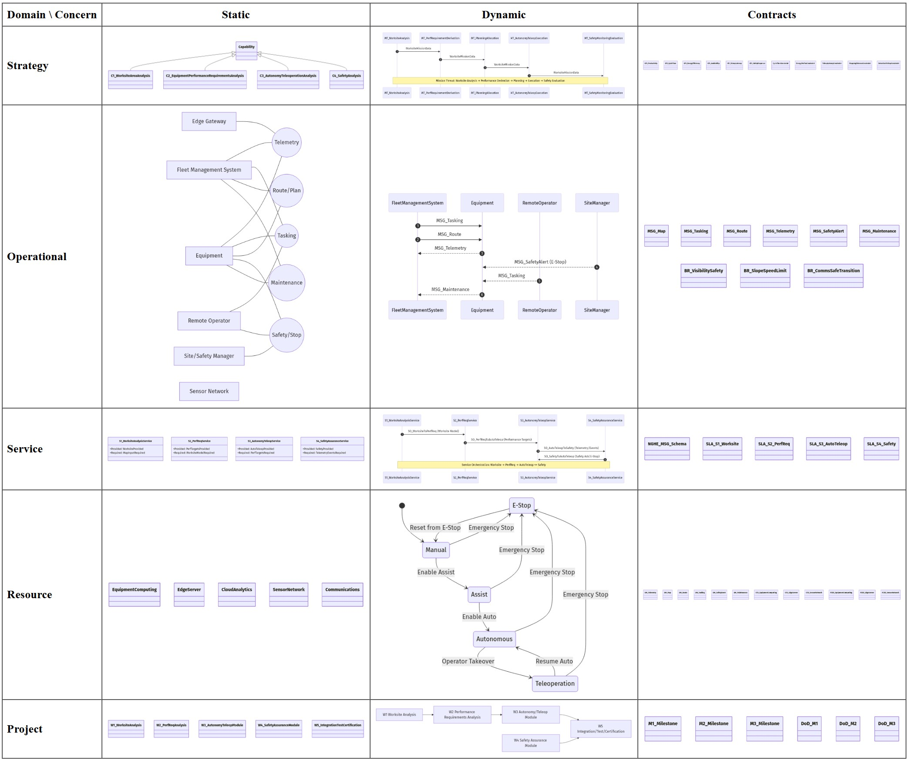

# S2AF — SysML v2 Aligned Architecture Framework

## Overview

**S2AF (SysML v2 Aligned Architecture Framework)** is a systematic architecture framework that organizes system engineering artifacts across a two-dimensional grid structure: **Domain × Concern**. The framework leverages SysML v2 modeling capabilities to provide comprehensive, traceable, and verifiable system architectures for complex systems.

### Key Principles

- **Domain-driven organization**: Five architectural domains (Strategy, Operational, Service, Resource, Project) capture different perspectives of the system
- **Concern-based analysis**: Three analytical concerns (Static, Dynamic, Contracts) systematically address structural, behavioral, and constraint aspects
- **SysML v2 alignment**: Native integration with SysML v2 artifacts (Definition, Structure, Activity, Interaction, State Machine, Data Definition, Parametric, Table)
- **End-to-end traceability**: Explicit links from capabilities through services to resources and project milestones
- **Quality-driven**: Built-in verification, validation, and compliance mechanisms

## Framework Structure

### The S2AF Grid (Domain × Concern)

| Domain | Focus | Static (Definition/Structure) | Dynamic (Activity/Interaction/State) | Contracts (Data/Parametric/Table) |
|:-------|:------|:------------------------------|:-------------------------------------|:----------------------------------|
| **Strategy** | Why | Capability taxonomy, usage decomposition | Mission threads, state strategies | KPIs, constraints, roadmaps |
| **Operational** | What | Performers, ports, needlines | Activities, sequences, workflows | Business rules, information schemas |
| **Service** | How | Service specifications, ports | Orchestration, service interactions | SLAs, APIs, policies |
| **Resource** | With What | System/component structures | Event traces, state machines | Performance, standards, security |
| **Project** | When | WBS, work packages | Workflows, dependencies | Milestones, schedules, traceability |

### Three Analytical Concerns

1. **Static (Definition/Structure)**: What exists and how it is organized
   - Definitions, taxonomies, decompositions
   - Structural relationships, ports, interfaces
   - Type specifications and configurations

2. **Dynamic (Activity/Interaction/State)**: How things behave and interact
   - Activities, workflows, processes
   - Interaction sequences, message flows
   - State machines, mode transitions

3. **Contracts (Data/Parametric/Table)**: What is agreed upon and constrained
   - Data definitions, schemas, protocols
   - Parametric constraints, equations
   - Tables, matrices, traceability links

## Project Structure

```
S2AF/
├── README.md                 # This file - project overview and introduction
├── docs/                     # Framework documentation (planned)
│   ├── S2AF.md              # Framework methodology (planned)
│   ├── S2AF_grid.md         # Grid structure details (planned)
│   └── S2AF_process.md      # Application process guidance (planned)
├── src/                      # SysML v2 framework definitions
│   ├── s2af/                # Core S2AF type library
│   │   ├── Level1BaseTypes.sysml           # Foundation types
│   │   ├── Level2DomainTypes.sysml         # Domain-specific types
│   │   ├── Level3ArchitectureTypes.sysml   # Architecture patterns
│   │   └── S2AF_Grid.sysml                 # Grid structure definition
│   └── utils/               # Utility scripts
│       └── s2af_grid_render.py             # Grid visualization generator
├── examples/                 # Case study implementations
│   ├── mumt/                # Manned-Unmanned Teaming case study
│   │   ├── S2AF_example_MUMT.md           # Case study documentation
│   │   ├── mumt.sysml                      # SysML v2 model
│   │   └── [Domain]_[Concern]/            # Generated diagrams per grid cell
│   └── nghe/                # Next Generation Heavy Equipment case study
│       ├── S2AF_example_NGHE.md           # Case study documentation
│       ├── nghe.sysml                      # SysML v2 model
│       └── [Domain]_[Concern]/            # Generated diagrams per grid cell
└── out/                      # Generated outputs (grids, reports)
    └── grids/               # HTML grid visualizations
        ├── mumt/
        └── nghe/
```

## Case Studies

The S2AF framework has been applied to two comprehensive case studies demonstrating its versatility across different domains—from military collaborative operations to autonomous construction equipment. Each case study systematically populates the 5×3 grid structure with SysML v2 artifacts, establishing end-to-end traceability from strategic capabilities to project milestones.

### 1. MUMT — Manned-Unmanned Teaming

**Domain**: Military/defense collaborative operations

**Core Capabilities**:
- C1: Integrated Operational Area Analysis
- C2: Mission Control Concept Analysis
- C3: Autonomous Collaboration Analysis
- C4: Survivability/Security Analysis

**Key Features**:
- Multi-platform coordination (manned aircraft, UAV/UCAV, UGV)
- Real-time mission allocation with human-in-the-loop approval
- Distributed cooperation planning and consensus protocols
- Security assurance with encryption, key rotation, and anomaly detection
- Target-to-vector latency ≤ 5s, collaboration success rate ≥ 95%

**Location**: `examples/mumt/`


*Figure 1: MUMT S2AF Grid showing systematic distribution of SysML v2 artifacts across Strategy, Operational, Service, Resource, and Project domains with Static, Dynamic, and Contracts concerns.*

### 2. NGHE — Next Generation Heavy Equipment

**Domain**: Construction/mining autonomous equipment

**Core Capabilities**:
- C1: Worksite Area Analysis
- C2: Equipment Performance Requirements Analysis
- C3: Autonomy/Teleoperation Analysis
- C4: Safety Analysis

**Key Features**:
- Autonomous/teleoperated heavy equipment (excavators, loaders, dump trucks)
- Performance optimization (cycle time, energy efficiency, productivity)
- Multi-mode operation (Manual, Assist, Autonomous, Teleoperation, Safety Stop)
- Safety-critical systems with E-Stop, detection-to-stop ≤ 100ms
- Teleoperation latency p95 ≤ 150ms, availability ≥ 0.97

**Location**: `examples/nghe/`


*Figure 2: NGHE S2AF Grid demonstrating application to safety-critical autonomous equipment with comprehensive coverage of worksite analysis, performance requirements, autonomy/teleoperation, and safety concerns.*

## Getting Started

### Prerequisites

- **SysML v2 environment**: Compatible SysML v2 modeling tool or API
- **Python 3.x**: For grid rendering utilities
- **Visualization tools**: For diagram generation from SysML v2 models

### Applying S2AF to Your Project

1. **Define scope and key questions** (P0)
   - Identify stakeholders
   - Articulate key architectural questions
   - Prioritize grid cells based on project needs

2. **Populate the Strategy Domain**
   - Define capability taxonomy
   - Model mission threads
   - Establish KPIs and constraints
   - Create capability roadmap

3. **Develop Operational Domain**
   - Specify performers and information exchanges
   - Define operational activities
   - Model operational interactions
   - Establish business rules

4. **Architect Service Domain**
   - Specify service interfaces and ports
   - Define service orchestration
   - Establish SLAs and policies
   - Define data protocols

5. **Design Resource Domain**
   - Define system/component structures
   - Model state machines and event traces
   - Specify performance and standards constraints
   - Establish security requirements

6. **Plan Project Domain**
   - Create work breakdown structure
   - Define workflows and dependencies
   - Establish milestones and schedules
   - Build traceability matrices

7. **Verify and validate**
   - Ensure end-to-end traceability
   - Validate parametric constraints
   - Verify SLA compliance
   - Conduct quality gate reviews

## Key Benefits

- **Systematic completeness**: Grid structure ensures no architectural aspect is overlooked
- **Stakeholder alignment**: Domain-based organization speaks to different stakeholder concerns
- **Traceability**: Explicit links from strategy through implementation to project delivery
- **Verification**: Parametric constraints enable quantitative verification
- **Reusability**: Type library and patterns accelerate new project development
- **Standards compliance**: Built-in support for industry standards and regulations

## Contributing

This framework is under active development. Case studies demonstrate application patterns and best practices. Contributions of additional case studies, tooling improvements, and documentation enhancements are welcome.

## References

- **SysML v2**: [https://www.omgsysml.org/](https://www.omgsysml.org/) 
- **Case studies**: See `examples/` directory
