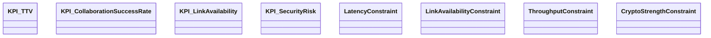
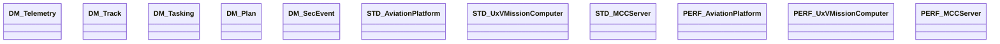

# S2AF Case Study — Manned-Unmanned Teaming (MUMT)

This case study demonstrates the application of `S2AF — SysML v2 Aligned Architecture Framework` to the Manned-Unmanned Teaming (MUMT) domain. The architecture is organized around four core analytical capabilities, with SysML v2 artifacts systematically distributed across the S2AF grid (Domain × Concern):

1) Integrated Operational Area Analysis
2) Mission Control Concept Analysis
3) Autonomous Collaboration Analysis
4) Survivability/Security Analysis

 
---

## 0. Scope and Key Questions (P0)

- **Stakeholders**: Mission Commander, Flight Squadron, UxV Operators, Comm/Security Officers, System Engineers, PM
- **Key Questions**
  - Which capabilities and services/resources are essential for MUMT mission success?
  - What is the quantitative effect of autonomous collaboration on mission time and success rate?
  - Where and how are survivability/security requirements (detection avoidance, link protection) satisfied/verified?
  - At which project milestones are which capabilities delivered?
- **Priority Cells**: Strategy—Static/Dynamic/Contracts, Operational—Static/Dynamic, Service—All concerns, Resource—All concerns, Project—Contracts

---

## 1. Strategy Domain (Why)

- **Capability Taxonomy (Definition)**
  - MUMT Core Capability
    - C1: Integrated Operational Area Analysis
    - C2: Mission Control Concept Analysis
    - C3: Autonomous Collaboration Analysis
    - C4: Survivability/Security Analysis
- **Mission Thread (Activity/Interaction)**
  - Detect (Sensor) → Integrated Assessment (Fusion) → Mission Allocation/Control → Collaborative Execution → Evaluate/Replan
- **KPIs (Data Definition)** Examples
  - TTV (Target-to-Vector) mission allocation latency ≤ 5s
  - Collaboration success rate ≥ 95% (10% packet loss assumption in degraded comms)
  - Survivability (SV): Link availability ≥ 0.98 under EW environment
  - Security Risk Index (SecRisk) ≤ 0.2 (vulnerability × exposure × impact model)
- **Constraints (Parametric)** Examples
  - latency_total = latency_sense + latency_fuse + latency_control + latency_link ≤ 5s
  - availability_link ≥ 0.98, throughput_ctrl ≥ 200 kbps, crypto_strength ≥ AES-256
- **Roadmap (Table)**

| Capability | R1 | R2 | R3 |
|:--|:--:|:--:|:--:|
| C1 Integrated Operational Area Analysis | ✓ (Basic) | Advanced Fusion | Real-time Extension |
| C2 Mission Control Concept Analysis | Concept/Simulation | ✓ (Initial Operations) | Advanced Adaptive Control |
| C3 Autonomous Collaboration Analysis | Concept | Pilot | ✓ (Operational) |
| C4 Survivability/Security Analysis | Baseline | Enhanced | ✓ (Advanced) |

---

## 2. Operational Domain (What)

- **Performers (Definition/Structure)**
  - Manned Aircraft, UAV/UCAV, UGV (optional), Mission Control Center (MCC), Data Link Relay Node
  - Information Exchange (Needlines): Sensor data, Control/Status, Cooperation Plan, Security Status/Alert
- **Operational Activities (Activity)**
  - OA1: Operational Area Data Collection/Normalization (sensor, intelligence)
  - OA2: Integrated Assessment/Risk Evaluation
  - OA3: Mission Allocation/Control (Human-Machine Collaboration)
  - OA4: Autonomous Collaboration Execution/Replanning
  - OA5: Survivability/Security Monitoring/Response
- **Operational Interactions (Interaction)**
  - MCC ↔ Manned Aircraft ↔ UAV: Mission planning/status/alert message sequences
- **Business Rules (Parametric)**
  - If classification confidence < θ, human approval is required; If risk > R_thr, escalate control link encryption strength
- **Information Structure (Data Definition)**
  - Messages: Track, Tasking, CoopPlan, Health/SecAlert

---

## 3. Service Domain (How-as-a-Service)

- **Service Specifications (Definition/Structure)**
  - S1 FusionService: Multi-sensor fusion/threat assessment, provided/required port definitions
  - S2 MissionControlService: Mission planning/allocation/monitoring, HIL approval workflow
  - S3 CoopService: Distributed cooperation planning/consensus/conflict resolution
  - S4 SecAssuranceService: Security monitoring/encryption/key rotation/anomaly detection
- **Behavior/Orchestration (Activity/Interaction)**
  - Service interaction sequence: Fusion→Control→Coop→SecAssurance
- **Data/Protocol (Data Definition)**
  - MUMT-MSG v1 schema (Track/Tasking/Plan/SecAlert), gRPC/REST hybrid, STANAG/ROS2 compatible
- **SLA/Policy (Parametric/Table)**

| Service | Latency p95 | Availability | Security Policy |
|:--|:--:|:--:|:--|
| S1 Fusion | ≤ 800 ms | ≥ 99.5% | Data integrity, source tracking required |
| S2 Control | ≤ 500 ms | ≥ 99.9% | Approval required/audit log, RBAC |
| S3 Coop | ≤ 700 ms | ≥ 99.7% | Consensus log (immutable), time sync |
| S4 SecAssurance | ≤ 300 ms | ≥ 99.9% | AES-256, key rotation ≤ 24h |

---

## 4. Resource Domain (With What)

- **System/Configuration (Definition/Structure)**
  - Aviation Platform: Avionics suite, sensor package, data link module
  - UxV: Autopilot, mission computer, security module (HSM)
  - Ground: MCC server, edge gateway, KMS, IDS/IPS
- **Event Trace/State (Interaction/StateMachine)**
  - Link states: {Normal, Jammed, Alternative Path, Down} transitions and recovery logic
- **Data Models (Data Definition)**
  - Physical/Logical: Telemetry, Track, Tasking, Plan, SecEvent
- **Performance/Standards/Constraints (Parametric/Table)**

| Resource | Throughput | Link | Encryption | Standards/Specifications |
|:--|:--:|:--:|:--:|:--|
| Aviation Platform | ≥ 50 Mbps | LOS/BLOS | AES-256/GCM | STANAG-XXX, DO-178C |
| UxV Mission Computer | ≥ 20 TOPS | UHF/L-band | AES-256 | ROS2, DDS-XRCE |
| MCC Server | ≥ 10k msg/s | Multi-path | TLS1.3 | ISO-27001, NIST-800-53 |

---

## 5. Project Domain (When)

- **WBS/Decomposition (Definition)**: 
  - W1 Integrated Operational Area Analysis Module, W2 Mission Control Module, W3 Autonomous Collaboration Module, W4 Security Assurance Module, W5 Integration/Test
- **Workflow/Dependencies (Activity)**: W1→W2→W3, W4 in parallel, W5 joins at integration phase
- **Milestones (Table)**

| Milestone | Schedule | Deliverables |
|:--|:--:|:--|
| M1 | R1 | C1 basic, S1 draft, resource baseline |
| M2 | R2 | C2 initial operations, S2/3 pilot, link path redundancy |
| M3 | R3 | C3/4 operational, SLA/security advanced, full-spectrum verification |

---

## 6. Grid Mapping 

Each capability (C1~C4) is mapped to Domain × Concern cells with key SysML v2 artifacts summarized.

| Domain/Concern | Static (Definition/Structure) | Dynamic (Activity/Interaction/State) | Contracts (Data/Parametric/Table) |
|:--|:--|:--|:--|
| Strategy (Why) | C1~C4 capability tree, usage decomposition | Mission thread (detect→collaborate), state strategy | KPI/constraints/roadmap tables |
| Operational (What) | Performers/ports/needlines | OA1~OA5 activities/sequences | Business rules constraints, information schema |
| Service (How) | S1~S4 service specs/ports | Orchestration sequences | SLA/policy matrix |
| Resource (With What) | Aviation/UxV/MCC structure | Link state machines/events | Performance/standards/security constraints |
| Project (When) | WBS/W1~W5 | Workflow/dependencies | Milestone/traceability tables |

---

## 7. Traceability (Table)

- **Capability ↔ Service**

| Capability | Services |
|:--|:--|
| C1 Integrated Operational Area Analysis | S1 Fusion |
| C2 Mission Control Concept Analysis | S2 MissionControl |
| C3 Autonomous Collaboration Analysis | S3 Coop |
| C4 Survivability/Security Analysis | S4 SecAssurance |

- **Service ↔ Resource**

| Service | Resource Bindings |
|:--|:--|
| S1 | MCC Server, UxV Platform |
| S2 | MCC Server |
| S3 | UxV Platform |
| S4 | KMS, IDS/IPS |

- **Capability/Service ↔ Milestone**

| Item | M1 | M2 | M3 |
|:--|:--:|:--:|:--:|
| C1/S1 | ✓ | upd | upd |
| C2/S2 |  | ✓ | upd |
| C3/S3 |  | pilot | ✓ |
| C4/S4 |  | enh | ✓ |

---

## 8. Quality Gates (Excerpt)

- Parametric verification cases for KPIs/constraints exist and pass
- Evidence of service SLA p95 latency, availability, and encryption policy compliance (logs/reports)
- End-to-end traceability links from capability→operational→service→resource→project complete

---

## 9. Artifacts (SysML v2 Views)

- Definition: Capability tree (C1~C4), performer/service types
- Structure (Usage): Aviation/UxV internal structure, ports/connectors, interface conformance
- Activity: Mission flows, operational activities, approval workflows
- Interaction: Collaboration/control sequences, event traces
- State Machine: Link state/recovery, platform mode transitions
- Data Definition: Message schemas/metrics/glossary
- Parametric: Performance/security/policy constraint models
- Table: Roadmap/milestone/traceability matrices

---

## 10. SysML Views

- **Capability Tree (Definition)**

- **Mission Thread (Sequence / Activity)**

- **Link State Machine (State Machine)**

- **Service Orchestration (Sequence)**

- **Operational Performer Structure (Definition)**

- **Service Catalog (Definition)**

- **Resource System Configuration (Definition)**

- **Project Workflow (Activity)**

- **Strategy Contracts (KPI/Constraints Overview)**

- **Operational Interaction (Sequence)**

- **Operational Information Items (Definition)**

- **Operational Business Rules (Definition)**

- **Resource Contracts (Data Models / Standards / Performance)**

- **Project Structure (Definition)**

- **Service Contracts (API / SLA)**

- **Project Contracts (Milestones / DoD)**

