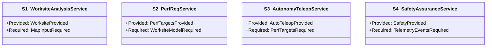
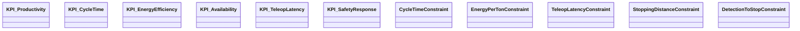
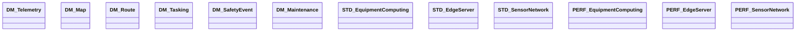

# S2AF Case Study — Next Generation Heavy Equipment (NGHE)

This case study demonstrates the application of `S2AF — SysML v2 Aligned Architecture Framework` to the Next Generation Heavy Equipment (NGHE) domain. The architecture is organized around four core analytical capabilities, with SysML v2 artifacts systematically distributed across the S2AF grid (Domain × Concern):

1) Worksite Area Analysis
2) Equipment Performance Requirements Analysis
3) Autonomy/Teleoperation Analysis
4) Safety Analysis

Reference: For framework overview, see `docs/S2AF.md`; for integrated grid structure, see `docs/S2AF_grid.md`; for process guidance, see `docs/S2AF_process.md`.

---

## 0. Scope and Key Questions (P0)

- **Stakeholders**: Site Manager, Equipment Operator, Tele-operator, Safety Manager, Maintenance/Quality, System Engineer, Project Manager
- **Key Questions**
  - Which capabilities, services, and resources directly improve worksite productivity and safety?
  - How are equipment performance requirements (cycle time, energy efficiency, availability) derived and verified?
  - What are the latency/reliability/availability targets for autonomy/teleoperation, and how are they reflected in equipment/network design?
  - How are safety requirements (stopping distance, detection-to-stop delay, risk reduction) and standards compliance demonstrated?
- **Priority Cells**: Strategy—Static/Dynamic/Contracts, Operational—Static/Dynamic, Service—All concerns, Resource—All concerns, Project—Contracts

---

## 1. Strategy Domain (Why)

- **Capability Taxonomy (Definition)**
  - NGHE Core Capability
    - C1: Worksite Area Analysis
    - C2: Equipment Performance Requirements Analysis
    - C3: Autonomy/Teleoperation Analysis
    - C4: Safety Analysis
- **Mission Thread (Activity/Interaction)**
  - Worksite analysis → Performance requirement derivation → Work planning/allocation → Autonomy/teleoperation execution → Safety monitoring/response → Performance evaluation/replanning
- **KPIs (Data Definition)** Examples
  - Productivity: m³/h or ton/h ≥ target
  - Cycle Time (load→travel→dump): p95 ≤ target
  - Energy Efficiency: kWh/ton or L/ton ≤ target
  - Availability ≥ 0.97, MTBF ≥ target
  - Teleoperation latency p95 ≤ 150 ms, packet loss ≤ 1%
  - Safety: collisions = 0, near-miss rate ≤ threshold, detection-to-stop time ≤ 100 ms
- **Constraints (Parametric)** Examples
  - cycle_time_total = t_load + t_travel + t_dump ≤ CT_target
  - energy_per_ton = energy_used / ton_moved ≤ E_target
  - teleop_latency_p95 ≤ 150 ms, link_availability ≥ 0.999
  - stopping_distance ≥ f(vehicle_speed, brake_delay, surface_μ)
  - detection_to_stop_time = perception_delay + control_delay + brake_delay ≤ 100 ms
- **Roadmap (Table)**

| Capability | R1 | R2 | R3 |
|:--|:--:|:--:|:--:|
| C1 Worksite Area Analysis | ✓ (Basic Mapping) | Real-time Update | Digital Twin Integration |
| C2 Performance Requirements Analysis | Baseline Derivation | Data-driven Calibration | Adaptive Optimization |
| C3 Autonomy/Teleoperation Analysis | Remote Pilot | Autonomy Assist | ✓ (Autonomous Operation) |
| C4 Safety Analysis | Baseline/HAZOP | SOTIF/Case Enrichment | ✓ (Advanced & Audited) |

---

## 2. Operational Domain (What)

- **Performers (Definition/Structure)**
  - Equipment (excavator, loader, dump truck, etc.), Remote Operator, Site/Safety Manager, Fleet Management System, Edge Gateway, Sensor Network
  - Information Exchange (Needlines): Telemetry, Tasking, Route/Plan, Safety/Stop signals, Maintenance alerts
- **Operational Activities (Activity)**
  - OA1: Worksite Data Collection/Mapping (terrain/obstacles/work zones)
  - OA2: Performance Requirement Analysis/Verification (cycle time, energy, availability)
  - OA3: Work Planning/Allocation and Autonomy/Teleoperation Execution
  - OA4: Safety Monitoring/Risk Response (E-Stop/deceleration/avoidance)
  - OA5: Performance Analysis/Maintenance Planning/Replanning
- **Operational Interactions (Interaction)**
  - Fleet Management ↔ Equipment ↔ Remote Operator: planning/status/safety alert message sequences
- **Business Rules (Parametric)**
  - If visibility < θ or human detected → decelerate/stop; If slope > φ_thr → speed limit; If communication quality < q_thr → remote→local safe transition
- **Information Structure (Data Definition)**
  - Messages: Map, Tasking, Route, Telemetry, SafetyAlert, Maintenance

---

## 3. Service Domain (How-as-a-Service)

- **Service Specifications (Definition/Structure)**
  - S1 WorksiteAnalysisService: Worksite model/update, risk area identification
  - S2 PerfReqService: Performance requirement derivation/monitoring/calibration
  - S3 AutonomyTeleopService: Autonomy assist/path planning/teleoperation HIL
  - S4 SafetyAssuranceService: Detection/alert/E-Stop/safety logging
- **Behavior/Orchestration (Activity/Interaction)**
  - Service interaction sequence: Worksite→PerfReq→Autonomy/Teleop→Safety
- **Data/Protocol (Data Definition)**
  - NGHE-MSG v1 (map/work/route/telemetry/safety), gRPC/REST, industrial fieldbus/ROS2 integration
- **SLA/Policy (Parametric/Table)**

| Service | Latency p95 | Availability | Policy/Security |
|:--|:--:|:--:|:--|
| S1 Worksite | ≤ 1.0 s | ≥ 99.5% | Data lineage, consistency checks |
| S2 PerfReq | ≤ 2.0 s | ≥ 99.5% | Baseline/calibration history management |
| S3 Autonomy/Teleop | ≤ 150 ms | ≥ 99.9% | RBAC, control audit logs |
| S4 Safety | ≤ 100 ms | ≥ 99.99% | Encryption, redundancy, immutable logs |

---

## 4. Resource Domain (With What)

- **System/Configuration (Definition/Structure)**
  - Equipment Platform: Powertrain, work attachment, autonomy/teleoperation module, safety H/W (E-Stop, HSM)
  - Sensors: LiDAR, radar, cameras, ultrasonic, IMU, GNSS/RTK
  - Communications: 5G/private radio/Wi-Fi 6, V2X, industrial bus
  - Computing: Edge (on-equipment), site server, cloud analytics
- **Event Trace/State (Interaction/StateMachine)**
  - States: {Manual, Assist, Autonomous, Teleoperation, Safety Stop} transitions; safe transition logic on communication failure
- **Data Models (Data Definition)**
  - Physical/Logical: Telemetry, Map, Route, Tasking, SafetyEvent, Maintenance
- **Performance/Standards/Constraints (Parametric/Table)**

| Resource | Throughput/Performance | Link | Encryption | Standards/Specifications |
|:--|:--:|:--:|:--:|:--|
| Equipment Computing | ≥ 10 TOPS | 5G/private radio | AES-256/GCM | IEC 61508 (concept), ISO 13849 (concept) |
| Edge/Site Server | ≥ 5k msg/s | Wired/wireless hybrid | TLS1.3 | ISO 27001 |
| Sensor Network | ≥ 1Gbps | TSN/Ethernet | MACsec (optional) | Industrial safety/EMC general |

---

## 5. Project Domain (When)

- **WBS/Decomposition (Definition)**: 
  - W1 Worksite Analysis, W2 Performance Requirements Analysis, W3 Autonomy/Teleoperation Module, W4 Safety Assurance, W5 Integration/Test/Certification
- **Workflow/Dependencies (Activity)**: W1→W2→W3, W4 in parallel, W5 integration followed by verification/certification
- **Milestones (Table)**

| Milestone | Schedule | Deliverables |
|:--|:--:|:--|
| M1 | R1 | C1 basic, S1 draft, resource baseline |
| M2 | R2 | C2 refined, S2/3 pilot, safety logic v1 |
| M3 | R3 | C3/4 operational, SLA/safety advanced, certification package |

---

## 6. Grid Mapping

| Domain/Concern | Static (Definition/Structure) | Dynamic (Activity/Interaction/State) | Contracts (Data/Parametric/Table) |
|:--|:--|:--|:--|
| Strategy (Why) | C1~C4 capability tree/usage decomposition | Mission thread (worksite→safety) | KPI/constraints/roadmap tables |
| Operational (What) | Performers/ports/needlines | OA1~OA5 activities/sequences | Business rules constraints, information schema |
| Service (How) | S1~S4 service specs/ports | Orchestration sequences | SLA/policy matrix |
| Resource (With What) | Equipment/sensor/comms/computing structure | State machines/events | Performance/standards/security constraints |
| Project (When) | WBS/W1~W5 | Workflow/dependencies | Milestone/traceability tables |

---

## 7. Traceability (Table)

- **Capability ↔ Service**

| Capability | Services |
|:--|:--|
| C1 Worksite Area Analysis | S1 WorksiteAnalysis |
| C2 Performance Requirements Analysis | S2 PerfReq |
| C3 Autonomy/Teleoperation Analysis | S3 AutonomyTeleop |
| C4 Safety Analysis | S4 SafetyAssurance |

- **Service ↔ Resource**

| Service | Resource Bindings |
|:--|:--|
| S1 | Sensor Network, Edge/Site Server |
| S2 | Edge/Site Server, Cloud Analytics |
| S3 | Equipment Computing, Communications |
| S4 | Sensor Network, Communications |

- **Capability/Service ↔ Milestone**

| Item | M1 | M2 | M3 |
|:--|:--:|:--:|:--:|
| C1/S1 | ✓ | upd | upd |
| C2/S2 |  | ✓ | upd |
| C3/S3 |  | pilot | ✓ |
| C4/S4 |  | v1 | ✓ |

---

## 8. Quality Gates (Excerpt)

- Parametric verification cases for KPIs/constraints (cycle time/latency/stop time) exist and pass
- Evidence of service SLA p95 latency, availability, and security policy compliance (logs/reports)
- End-to-end traceability links from capability→operational→service→resource→project complete and auditable

---

## 9. Artifacts (SysML v2 Views)

- Definition: Capability tree (C1~C4), performer/service types
- Structure (Usage): Equipment/sensor/comms/computing internal structure, ports/connectors
- Activity: Mission flows, operational activities, approval/safety workflows
- Interaction: Work/teleoperation/safety sequences, event traces
- State Machine: Operational mode/safety transitions, link/equipment state transitions
- Data Definition: Map/work/route/telemetry/safety/maintenance schemas
- Parametric: Performance/energy/latency/stopping distance constraint models
- Table: Roadmap/milestone/traceability matrices

---

## 10. SysML Views

- **Capability Tree (Definition)**

- **Mission Thread (Sequence / Activity)**

- **Operational Mode State Machine (State Machine)**

- **Service Orchestration (Sequence)**

- **Operational Performer Structure (Definition)**

- **Service Catalog (Definition)**

- **Resource System Configuration (Definition)**

- **Project Workflow (Activity)**

- **Strategy Contracts (KPI/Constraints Overview)**

- **Operational Interaction (Sequence)**

- **Operational Information Items (Definition)**

- **Resource Contracts (Data Models / Standards / Performance)**

- **Project Structure (Definition)**

- **Operational Business Rules (Definition)**

- **Service Contracts (API / SLA)**

- **Project Contracts (Milestones / DoD)**

